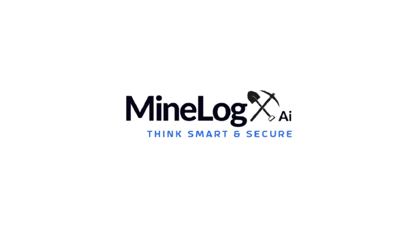

<p align="center">
  
</p>

<h1 align="center">🧠 MineLogX AI</h1>

<p align="center">
  <em>An open-source AI platform transforming mining operations through unified IoT data, analytics, and Watsonx intelligence.</em>
</p>

<p align="center">
  <a href="https://github.com/yourusername/MineLogX-AI">
    
  </a>
  <a href="https://github.com/yourusername/MineLogX-AI/issues">
    
  </a>
  <a href="LICENSE">
    
  </a>
</p>

---

## 🌍 Overview

**MineLogX AI** is a cloud-optimized, open-source platform built for mining companies seeking real-time insight, safety, and sustainability. It standardizes fragmented IoT data from legacy protocols like IP21, OSI PI, Modbus, and MQTT into a unified schema (IoT CSDF), ready for analytics and AI.

With IBM Watsonx embedded, it adds intelligent automation, conversational AI, and semantic search across mining data ecosystems.

---

## ⚙️ Key Features

- 📡 Protocol adapters for IP21, OSI PI, OPC UA, Modbus, MQTT  
- 🧠 AI-powered analytics with Watsonx integration  
- 💬 Natural language Q&A using Watsonx BI Assistant  
- 🧾 Semantic search across structured/unstructured mining data  
- 📊 Dashboards and ESG-ready reporting tools  
- 🔁 Scalable, cloud-native architecture (Snowflake, AWS, etc.)

---

## 🚀 Quick Start

### 🛠 Requirements

- Python 3.9+
- pip
- (Optional) Docker

### 🧑‍💻 Install & Run

```bash
git clone https://github.com/yourusername/MineLogX-AI.git
cd MineLogX-AI
python3 -m venv venv
source venv/bin/activate
pip install -r requirements.txt
python app.py
````

### 🐳 Docker Option

```bash
docker build -t minelogx-ai .
docker run -v $(pwd)/data:/app/data minelogx-ai --log data/sample.log
```

---

## 🧱 Project Structure

```

MinelogX-AI-framework/
├── README.md
├── LICENSE
├── CONTRIBUTING.md
├── docs/
│   ├── architecture.md
│   ├── usage-examples.md
│   ├── development-guide.md
│   ├── cloud-setup-guides/
│   │   ├── aws.md
│   │   ├── azure.md
│   │   ├── ibm-cloud.md
│   │   ├── snowflake.md
│   └── on-prem.md
├── onprem-only/
│   ├── infrastructure/
│   │   ├── terraform/
│   │   ├── ansible/
│   │   └── k8s/
│   ├── pipelines/
│   ├── connectors/
│   ├── modules/
│   ├── tests/
│   ├── scripts/
│   └── README.md
├── onprem-aws/
│   ├── infrastructure/
│   ├── pipelines/
│   ├── connectors/
│   ├── modules/
│   ├── tests/
│   ├── scripts/
│   └── README.md
├── onprem-aws-snowflake/
│   ├── infrastructure/
│   ├── pipelines/
│   ├── connectors/
│   ├── modules/
│   ├── tests/
│   ├── scripts/
│   └── README.md
├── onprem-azure/
│   ├── infrastructure/
│   ├── pipelines/
│   ├── connectors/
│   ├── modules/
│   ├── tests/
│   ├── scripts/
│   └── README.md
├── onprem-azure-snowflake/
│   ├── infrastructure/
│   ├── pipelines/
│   ├── connectors/
│   ├── modules/
│   ├── tests/
│   ├── scripts/
│   └── README.md
├── onprem-ibm/
│   ├── infrastructure/
│   ├── pipelines/
│   ├── connectors/
│   ├── modules/
│   ├── tests/
│   ├── scripts/
│   └── README.md
├── onprem-ibm-snowflake/
│   ├── infrastructure/
│   ├── pipelines/
│   ├── connectors/
│   ├── modules/
│   ├── tests/
│   ├── scripts/
│   └── README.md
├── shared/
│   ├── modules/
│   ├── connectors/
│   ├── templates/
│   └── README.md
├── .github/
│   ├── workflows/   # CI/CD actions
│   ├── ISSUE_TEMPLATE.md
│   └── PULL_REQUEST_TEMPLATE.md
└── LICENSE
```

---

## 🔭 Roadmap

* ✅ Support for major IoT protocols
* ⏳ Grafana-compatible exporter
* ⏳ CI/CD with GitHub Actions
* ⏳ Advanced Watsonx NLP summaries
* ⏳ Multi-cloud deployment templates

---

## 🤝 Contributing

We welcome contributions! Here’s how to get started:

1. Fork the repository 🍴
2. Create a new branch: `git checkout -b feature/amazing-feature`
3. Commit your changes 📝
4. Push to your fork: `git push origin feature/amazing-feature`
5. Submit a Pull Request ✅

---

## 📄 License

This project is licensed under the [MIT License](LICENSE).

---

## 💡 Notes

* Replace the logo path in `` with your actual logo path (local or hosted).
* If you’d like a `docs/` folder template or GitHub Pages setup, just ask!
* Add a `CONTRIBUTING.md` and `CODE_OF_CONDUCT.md` for open source best practices.

---

### 🚧 Let’s build the future of intelligent mining together with open data and AI.
