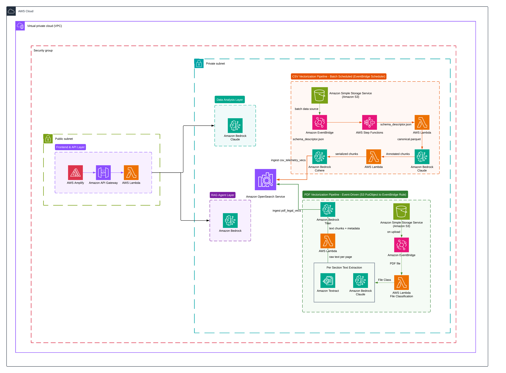

# System Overview — C4 Level 1 (Context)

This page describes **what MineLogX AI is**, **who uses it**, and **what external systems it interacts with**,
following the [C4 model](https://c4model.com/) Context level.

---

## What is MineLogX AI?

MineLogX AI is an operational intelligence platform for mining companies. It ingests IoT telemetry
from mining equipment (trucks, loaders, drills), computes fleet KPIs and anomaly signals, and
answers regulatory compliance questions grounded in jurisdiction-specific legal documents.

The platform is cloud-agnostic by design. The AWS implementation — documented here — uses
**Amazon Bedrock** for AI inference, **OpenSearch Serverless** for vector search, and **CloudFormation + Fabric**
for infrastructure automation.

---

## Architecture Diagram

---

## Users and External Systems

### Internal users

| User | Role | How they interact |
|---|---|---|
| **Mine Operations Staff** | Fleet operators, shift supervisors | Dashboard (KPIs, fleet status, fuel, GPS); natural language chat for operational questions |
| **Data Engineers** | Pipeline owners | Trigger CSV/PDF ingestion pipelines via Fabric; monitor index health via `fab opensearch.status` |
| **Compliance Officers** | Regulatory and legal teams | Chat interface for regulatory Q&A grounded in ingested legal documents |
| **Platform Engineers** | DevOps / cloud engineers | Deploy and manage environments via `fab env.*`; manage Bedrock model access |

### External systems

| System | Direction | What flows |
|---|---|---|
| **IoT sensors / SCADA** | → MineLogX | Raw telemetry CSV files (GPS, fuel, haul cycles, tire pressure, fatigue events, safety events) |
| **Regulatory repositories** | → MineLogX | PDF legal documents for Senegal, United States, and Chile jurisdictions |
| **Amazon Bedrock** | ↔ MineLogX | LLM inference (Claude Sonnet 4.6), embeddings (Cohere, Titan), guardrail evaluation |
| **AWS Amplify CDN** | → End users | Static React frontend served globally |

---

## Platform Capabilities

- **Fleet KPI dashboard** — fuel efficiency, vehicle utilization, idle rate, MTBF, payload utilization, CO₂/km
- **Anomaly detection** — flags operational outliers derived from telemetry vectors in OpenSearch
- **Compliance Q&A (RAG)** — hybrid semantic + lexical search over legal PDFs with citation tracing
- **Multi-model AI** — selectable LLM per query: Claude Sonnet 4.6 (default), Nova Pro, DeepSeek V3.2
- **Bedrock Guardrails** — prompt-injection defense, PII anonymization, topic denial at every AI touchpoint
- **IaC-driven environments** — ephemeral and fixed environments via CloudFormation + Fabric

---

## Key Boundaries

!!! warning "Raw data is never sent directly to AI models"
    All telemetry data passes through a validation and guardrail pipeline before reaching any
    Bedrock model or OpenSearch index. See [Data Flow](data-flow.md) for the lifecycle.

!!! info "Advisory outputs only"
    The RAG Compliance Agent returns regulatory information grounded in ingested documents.
    It does **not** provide legal counsel. Every response includes a disclaimer.
